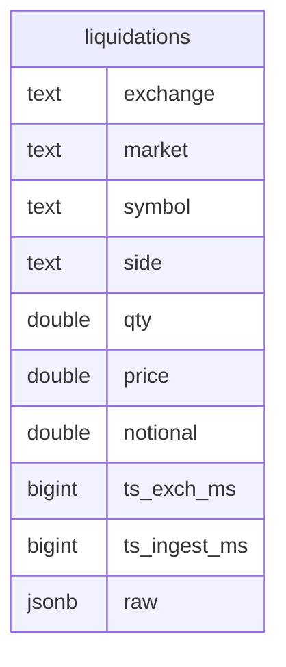
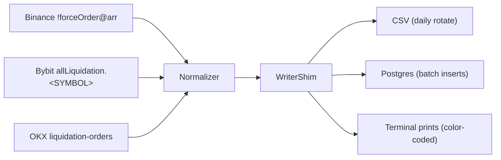

[](LICENSE)


Stream crypto **liquidation events** from multiple exchanges into clean CSVs or a Postgres database, with unified schema and daily file rotation.  
Supports **Binance (USDT-M & COIN-M)**, **Bybit (USDT-M & Inverse/COIN-M)**, and **OKX (USDT-M & COIN-M)**.

## ✨ Features
- 🔥 Run **all exchanges + markets at once** with one command (`--all`)
- 🎯 Choose a custom set of streams with `--streams`
- 💾 Write to **CSV, Postgres, or both**
- 🗂 Writes **daily CSVs** partitioned by exchange/market
- 🛢 Batched Postgres inserts with `asyncpg`
- 📊 Unified schema across exchanges
- 🎨 Color-coded console prints (long liqs = red, short liqs = green)
- 🔌 Adapter pattern → new exchanges easy to add

## 🚀 Quickstart
```bash
pip install -r requirements.txt

# Run everything (Binance + Bybit + OKX, USDT & COIN) → CSVs
python -m stream --all --outdir-root data

# Run everything → Postgres
python -m stream --all --sink pg --pg-dsn "postgresql://user:pw@localhost:5432/liqdb"

# Run everything → CSV + Postgres
python -m stream --all --sink both --outdir-root data --pg-dsn "postgresql://user:pw@localhost:5432/liqdb"
```

## 🎮 Usage Examples
```bash
# Run a custom set of streams
python -m stream --streams binance:usdt,bybit:coin,okx:usdt --outdir-root data

# Run a single stream (backward compatible)
python -m stream --exchange binance --market usdt --outdir data/binance_usdt

# Extra options
Print only (no CSV/DB):
python -m stream --all --no-write

Disable colors:
python -m stream --all --no-color

Control Bybit subscription chunk size:
python -m stream --streams bybit:usdt,bybit:coin --subscribe-chunk 50

Change Postgres batch + interval:
python -m stream --all --sink pg --pg-dsn "$PG_DSN" --pg-batch 50 --pg-interval 0.5
```

## 📁 Unified Schema
Each row has:

- **exchange**: binance | bybit | okx
- **market**: usdt | coin
- **symbol**: trading pair symbol
- **side**: long = long positions liquidated (forced sell), short = short positions liquidated (forced buy)
- **qty**: contracts/amount liquidated
- **price**: execution price
- **notional**: price × qty
- **ts_exch_ms**: exchange timestamp (ms)
- **ts_ingest_ms**: local ingest timestamp (ms)
- **raw**: compact JSON from the exchange

Files rotate daily (UTC).

## 📊 Schema diagram


## 📷 Data Flow



## 📌 Notes
- **Binance**: uses all-symbols liquidation feed (!forceOrder@arr), USDT-M via fstream, COIN-M via dstream.
- **Bybit**: auto-discovers all symbols via REST (linear for USDT-M, inverse for COIN-M), subscribes to each with allLiquidation.<SYMBOL>.
- **OKX**: single subscription to liquidation-orders (instType=SWAP), filters *-USDT/USDC-SWAP vs *-USD-SWAP.
